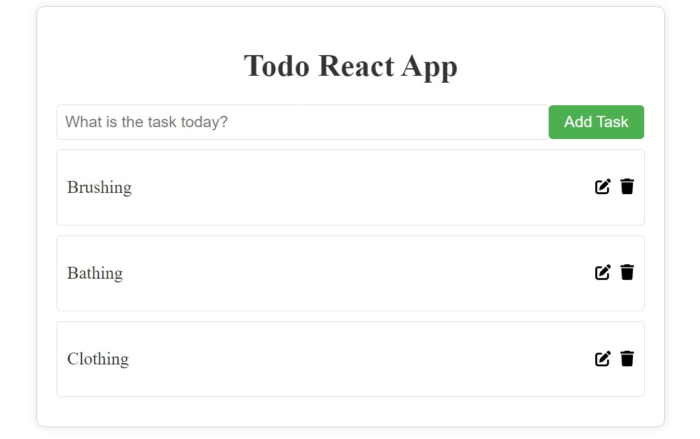

# Todo App React

Welcome to the Todo App React project! This simple React app allows you to manage your tasks with features like adding, editing, and deleting todos.

## Project Structure

-   **App.js**: The main component that includes the TodoWrapper, the core of the application.
-   **components/**
    -   **TodoWrapper.js**: Manages the state of todos and renders TodoForm and individual Todo components.
    -   **Todo.js**: Represents a single todo item with options to mark as complete, edit, and delete.
    -   **TodoForm.js**: Form to add new todos.
    -   **EditTodoForm.js**: Form to edit existing todos.

## Getting Started

1. Clone the repository:

    ```bash
    git clone https://github.com/harshm413/todo-app-react.git
    ```

2. Navigate to the project directory:

    ```bash
    cd todo-app-react
    ```

3. Install dependencies:

    ```bash
    npm install
    ```

4. Run the project:

    ```bash
    npm start
    ```

5. Open your browser and visit [http://localhost:3000](http://localhost:3000) to start managing your todos.

## Features

-   **Add Todo**: Enter a new task and click "Add Task" to add it to the list.
-   **Toggle Complete**: Click on a todo to mark it as completed or incomplete.
-   **Edit Todo**: Click the edit icon to update the task.
-   **Delete Todo**: Click the delete icon to remove a todo from the list.

## Technologies Used

-   React
-   FontAwesome for icons

## Project Preview



## Contributing

Feel free to contribute to the project by submitting issues or pull requests. Your feedback is highly appreciated!

## License

This project is open-source and available under the [MIT License](LICENSE).

Happy task management with Todo App React! 🚀✅
